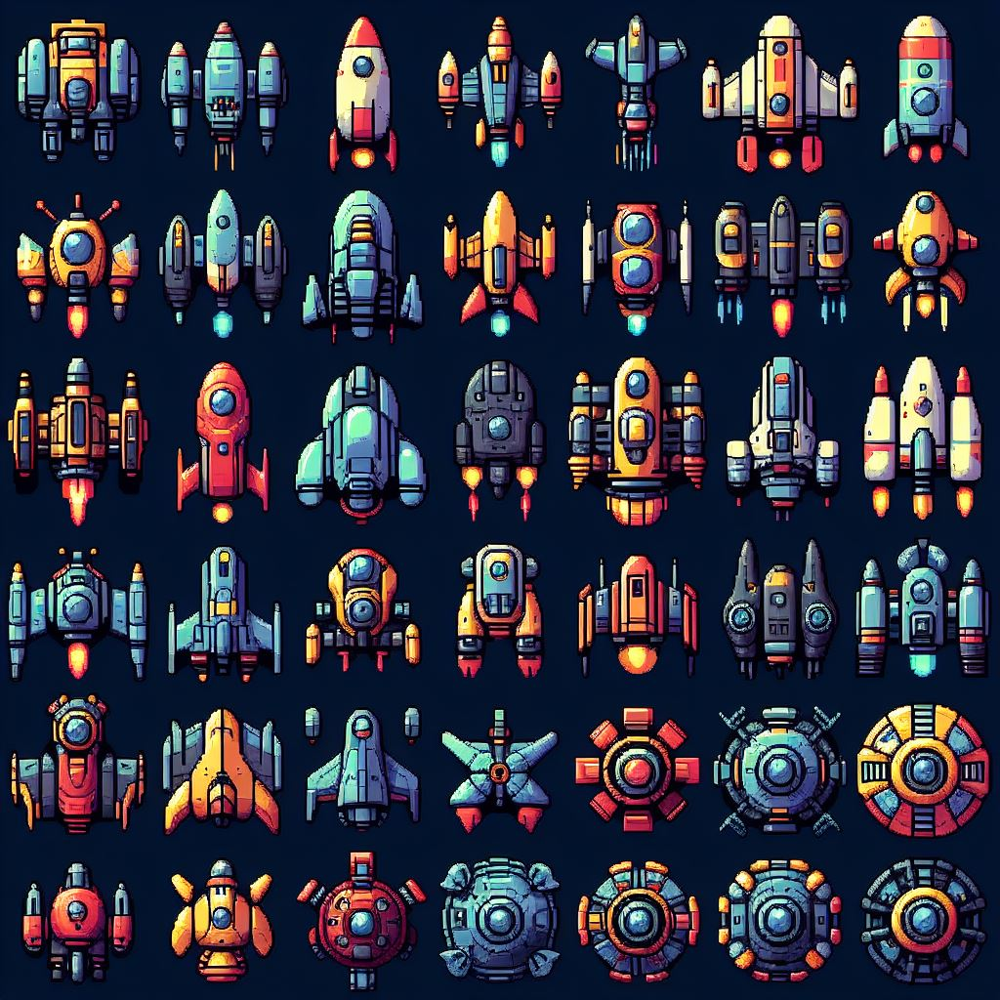
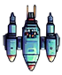
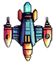
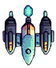
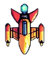
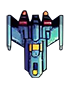

# A 2D spaceshooter built using vite, typescript and the canvas API
## Live demo deployed at
<a href="https://spaceshooter.kuenzang.xyz">spaceshooter.kuenzang.xyz</a>

## Setting up the project
```
git clone https://github.com/k31312020 spaceshooter.git
```
```
npm install
```
`npm run dev` for development server and `npm run build` for building

## Project strucutre

- `main.ts` contains the game loop 
- Rendering is handled by `requestanimationframe` 
- Game state, game object state and physics are handled by `setInterval`
- `ship.ts` contains the base `GameObject` class and all the extended classes 
- `utils.ts` contains helper functions and constants

## Sprites
Generated using DallE
, prompt used: 
`generate 2D sprites for diferent ships but I only want top view`


### Sprites used for player and enemies









<ul>
    <li>
        Music from #Uppbeat (free for Creators!):
        <a href="https://uppbeat.io/t/danijel-zambo/stardust">Track name: stardust</a> License code: YLGRRYNVCOBYBNA1 
    </li>
    <li>
        <a href="https://pixabay.com/sound-effects/laser-gun-shot-sound-future-sci-fi-lazer-wobble-chakongaudio-174883/">Sound name: Laser gun shot sound</a>
    </li>
    <li>
        <a href="https://pixabay.com/sound-effects/mech-keyboard-02-102918/">Sound name: Mech-keyboard-02</a>
    </li>
    <li>
        <a href="https://pixabay.com/sound-effects/explosion-6055/">Sound name: Explosion-6055</a>
    </li>
</ul>